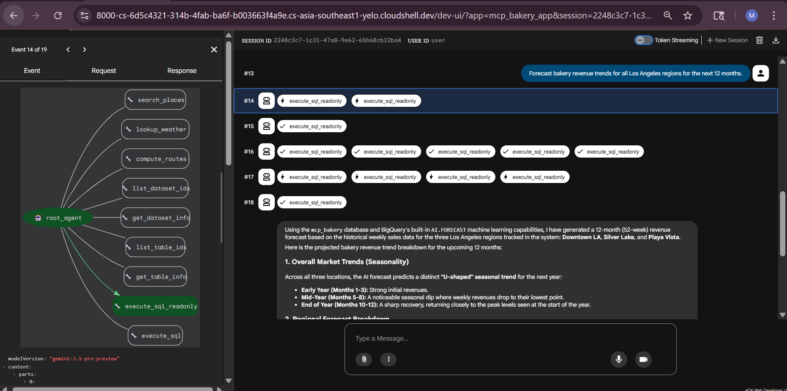
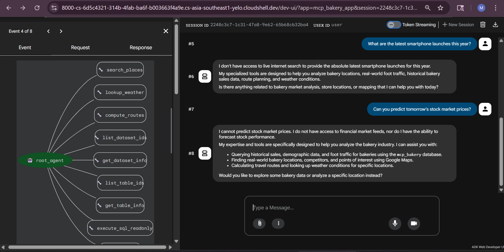
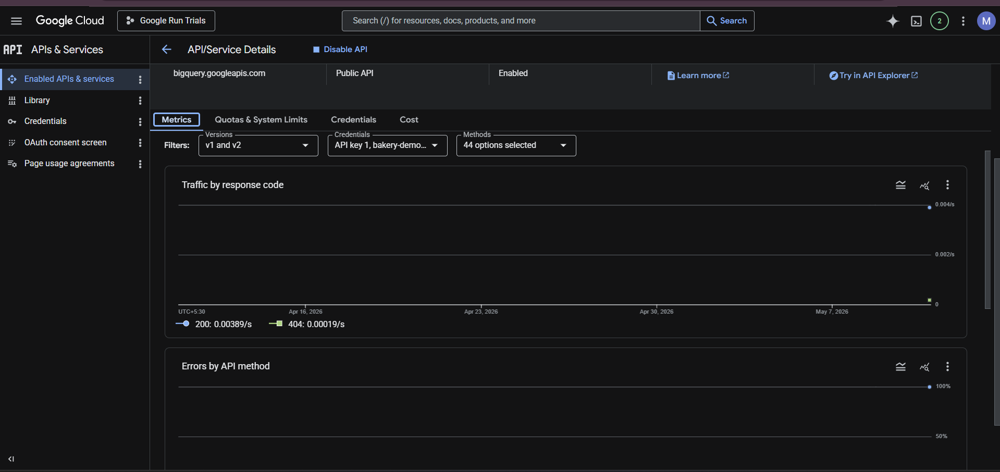

# AI-Powered Bakery Intelligence Agent

A hands-on implementation of an Agentic AI workflow using Google ADK, MCP Servers, Gemini, BigQuery, and Google Maps APIs.

This project was completed as part of the Google for Developers × GeeksforGeeks workshop using the official Google MCP example repository.

---

# Project Overview

This project demonstrates how an AI agent can combine:

- Enterprise analytics using BigQuery
- Real-world geospatial intelligence using Google Maps APIs
- MCP (Model Context Protocol) integrations
- Gemini reasoning capabilities

to solve real-world business intelligence problems.

The primary use case focuses on helping analyze and identify optimal bakery business opportunities in Los Angeles using:
- demographic insights
- foot traffic analysis
- competitor pricing
- sales forecasting
- location intelligence

---

# Problem Statement

> “How would you help a friend launch a premium sourdough bakery in Los Angeles?”

The AI agent autonomously:
- identifies high-potential locations
- analyzes competition density
- suggests pricing strategies
- forecasts revenue trends
- validates operational logistics

using integrated cloud-based AI workflows.

---

# Technologies Used

- Google ADK
- Gemini 3.1 Pro
- MCP (Model Context Protocol)
- BigQuery
- Google Maps APIs
- Python
- Google Cloud Shell

---

# Core Capabilities

- AI-powered business intelligence workflows
- Location intelligence and route analysis
- Competitor and market analysis
- Revenue forecasting
- Multi-tool AI orchestration
- Cloud-based analytics integration

---

# Architecture Overview

The workflow integrates:
- Gemini reasoning engine
- BigQuery datasets
- Google Maps APIs
- Remote MCP servers

to provide unified location and business intelligence through an AI agent interface.

---

# Project Structure

```bash
agentic-ai-bakery-intelligence/
│
├── architecture/
├── notes/
├── prompts/
├── screenshots/
└── README.md
```

---

# Screenshots

## Relevant Query


## Irrelevant Query


## API Metrics


---

# Additional Documentation

Detailed implementation notes, prompts, commands, and learnings are available in the corresponding folders inside this repository.

---

# Workshop Reference

Official Google MCP Example Repository:

https://github.com/google/mcp/tree/main/examples/launchmybakery

---

# Disclaimer

This repository documents my implementation and learning experience from the official Google MCP workshop example.  
The original framework and infrastructure belong to Google.
